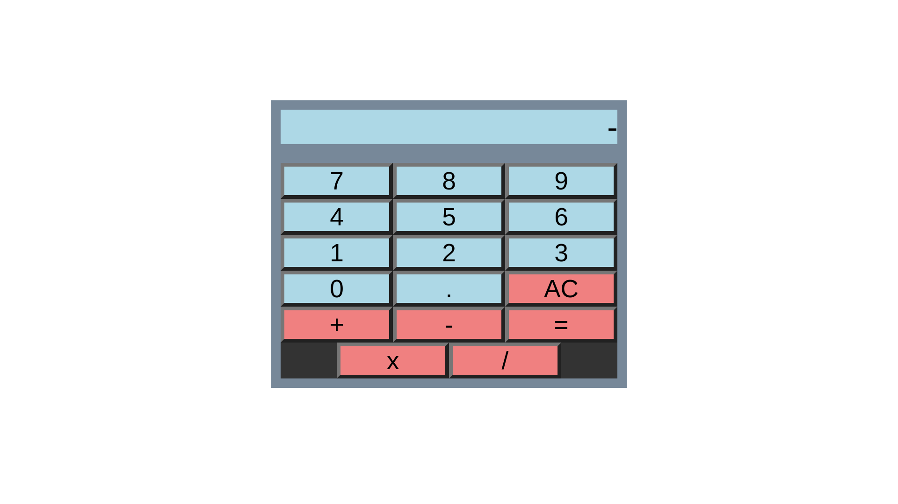

# Calculator

A simple calculator application built with JavaScript, HTML and CSS.

## Features

- Basic arithmetic operations: addition, subtraction, multiplication, and division
- Clear all
- Type float numbers (.)
- Keyboard support (just the numbers for now hehe)

## Future updates

1. Keyboard for operator numbers ("+", "-", "=", etc.)
2. Add a “backspace” button
3. History of previous calculations
4. Make it look nicer

Live site: https://alejancodegf.github.io/odin-Calculator/